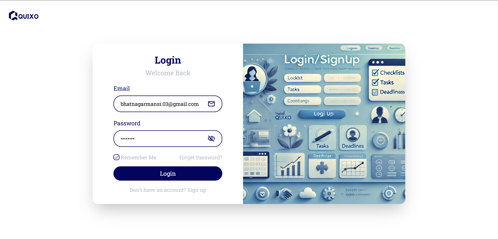
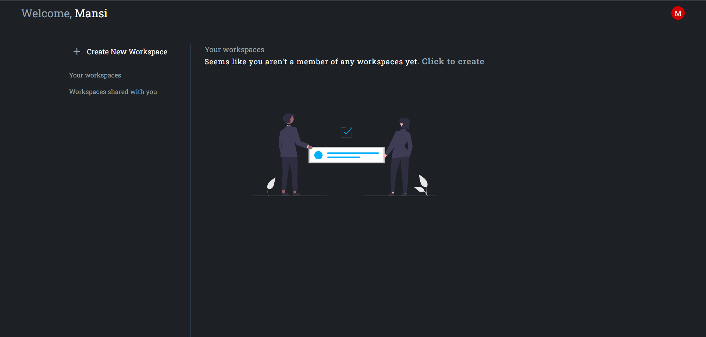
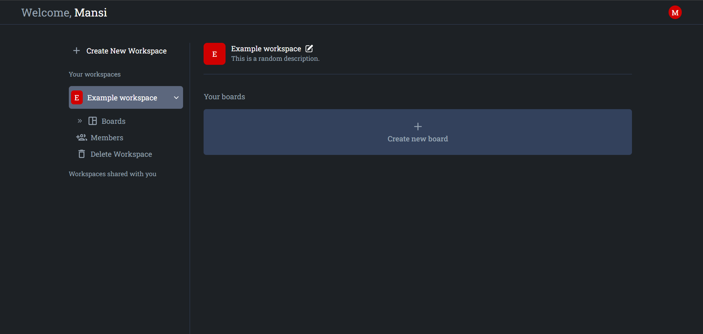
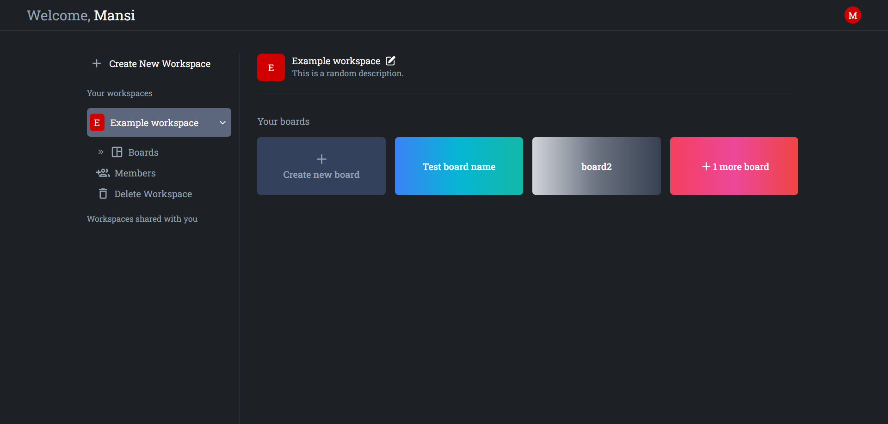
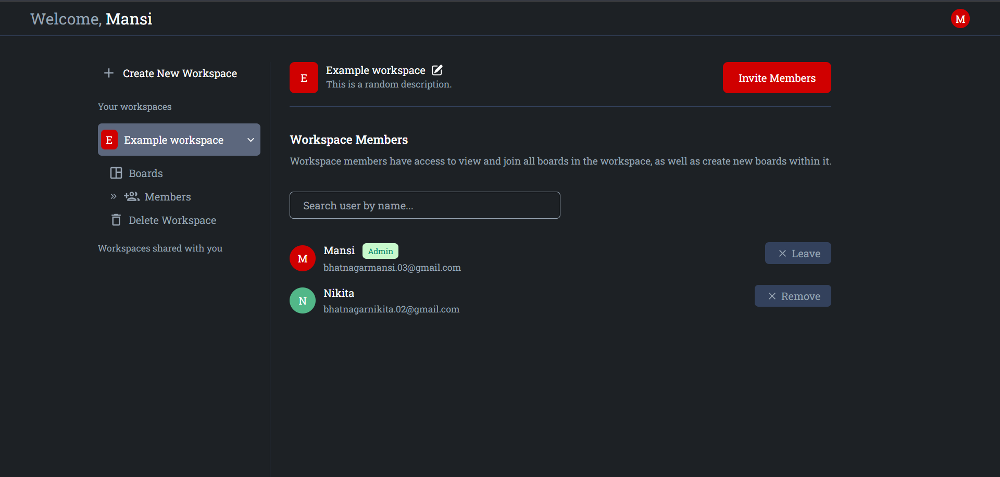
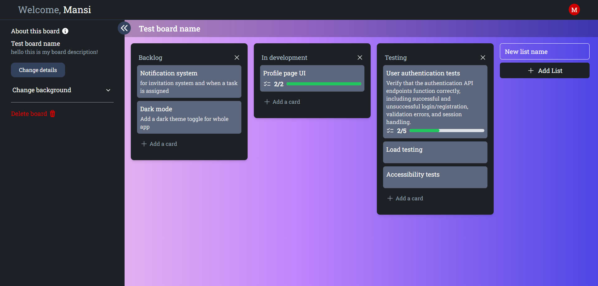
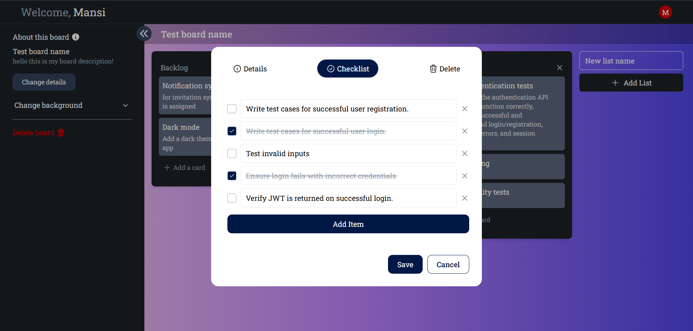

# Quixo - Task Management & Collaboration App

Quixo is a flexible and powerful task management app designed to help teams organize, plan, and collaborate seamlessly. With Quixo, you can track your progress, and keep everyone in sync, whether you're an individual or managing a small team or coordinating a large organization.

## Features

- ### Customizable Workspaces:

Set up dedicated workspaces for different teams or projects to keep tasks organized and streamlined.

- ### Intuitive Board & Card System:

Organize your tasks with boards and cards to create a clear visual of your workflow.

- ### Drag & Drop:

Move cards between lists with an easy drag-and-drop interface.

- ### Admin-Only Invitation System:

Protect your workspace access by allowing only admins to invite new users, ensuring that only authorized team members join.

- ### Checklists:

Break down tasks with checklists and track progress on each item to stay on top of deadlines.

- ### Custom Board Backgrounds with Gradients:

Personalize your boards by choosing from a variety of gradient backgrounds to match your team’s style or project theme.

## 

## 

## 

## 

## 

## 

## 

## Technologies/Libraries used

### &nbsp; &nbsp; Client Side

- **[react](https://react.dev/)**
- **[react-redux](https://redux.js.org/)**
- **[tailwindcss](https://tailwindcss.com/)**
- **[react-router-dom](https://reactrouter.com/en/main)**
- **[axios](https://axios-http.com/docs/intro)**
- **[tanstack/react-query](https://tanstack.com/query/latest)**
- **[headlessui/react](https://headlessui.com/)**
- **[heroicons/react](https://heroicons.com/)**
- **[react-toastify](https://fkhadra.github.io/react-toastify/installation/)**

### &nbsp; &nbsp; Server Side

- **[Flask](https://flask.palletsprojects.com/en/stable/)**
- **[SQLAlchemy](https://www.sqlalchemy.org/)**
- **[Flask-JWT-Extended](https://flask-jwt-extended.readthedocs.io/en/stable/)**
- **[Flask-Admin](https://flask-admin.readthedocs.io/en/latest/)**
- **[Flask-Mail](https://flask-mail.readthedocs.io/en/latest/)**
- **[Flask-Migrate](https://flask-migrate.readthedocs.io/en/latest/)**
- **[Flask-CORS](https://flask-cors.readthedocs.io/en/latest/api.html)**
- **[Flask-Session](https://flask-session.readthedocs.io/en/latest/)**

## Developed by

**[Mansi Bhatnagar](https://github.com/Mansi-Bhatnagar)** and **[Umesh Kumar](https://github.com/umesh70)**.
